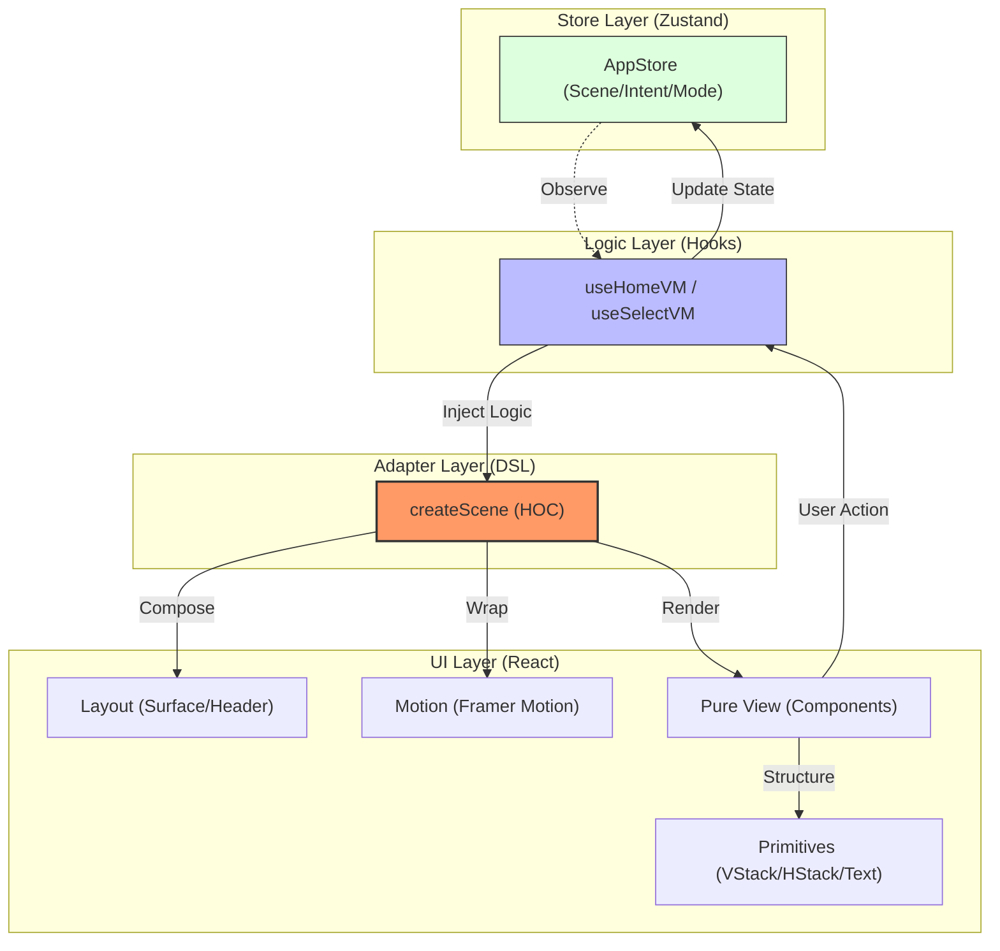

# aidentify v3.0

プライバシー保護を最優先にした AI 画像編集システムのプロトタイプ。
「動くもの」の先にある、拡張性と保守性を両立したシステムアーキテクチャの探求を目的としています。

[ここに実際の動作のGIFアニメーション、またはスクリーンショットを配置]
[framer-motion で動く滑らかな画面遷移のGIF MacのKapで作っとく]

---

## 💎 Key Concepts

本プロジェクトでは、インターンシップや実務での大規模開発を見据え、以下の3点を徹底しています。

### 1. Scene-Driven DSL (Architecture)
`Scene = Layout ∘ Motion ∘ (View + VM)`
独自の高階コンポーネント `createScene` を開発し、画面遷移のアニメーション、共通レイアウト、依存性の注入を「規約」として共通化しました。これにより、開発者はビジネスロジックとUI表現に集中できます。

### 2. Strict Type Safety
TypeScriptのGenericsを活用し、ViewModelとViewのデータ構造が一致しない限りビルドが通らない設計にしています。実行時エラーを最小限に抑え、安全なリファクタリングを可能にします。

### 3. Design-Code Sync
Figmaのデザインシステムを `Tailwind CSS` の設計（Design Tokens）に厳格にマッピングしています。
- [Figma Design File Link]

---

## 🛠 Tech Stack

- **Frontend**: Next.js 14 (App Router)
- **State Management**: Zustand
- **Animation**: Framer Motion
- **Styling**: Tailwind CSS, clsx, tailwind-merge
- **Testing**: Vitest, React Testing Library
- **Icons**: Lucide React

---

## 📁 Directory Structure

```text
src/
├── components/
│   ├── primitives/  # 原子単位のUI部品 (VStack, HStack, Glyph...)
│   ├── layout/      # 全画面共通の枠組み (Header, Surface)
│   └── assemblies/  # 複数の部品を組み合わせた機能単位
├── scenes/          # 画面ごとのAdapter (LogicとViewの結合)
├── viewmodel/       # 純粋なビジネスロジック・状態操作
├── store/           # グローバル状態 (Zustand)
└── domain/          # 型定義、ドメイン知識の集約

```

## 📐 Architecture Diagram



---

## 🚀 Getting Started

このプロジェクトは、開発者体験（DX）向上のためのブートストラップスクリプトを備えています。

```bash
# セットアップと依存関係のインストール
npm run setup

# 開発サーバーの起動
npm run dev

# テストの実行
npm run test

```

---

## 📑 Documentation

より深い設計意図については、以下のドキュメントを参照してください。

* [Architecture Detail](/docs/ARCHITECTURE.md) - なぜこのパターンを採用したのか
* [Design System](/DESIGN_SYSTEM.md) - Figmaとの連携とコンポーネント設計
* Figma: [デザインファイル](https://www.figma.com/design/7Mx1oGmjI7TZVhLMN0O1BC/Aidentify-UI?node-id=2018-314&t=BNiz9XHR42Qde2zH-1)

```

package.json
```json
"scripts": {
  "setup": "chmod +x docs/assets/bootstrap.sh && ./docs/assets/bootstrap.sh"
}
```